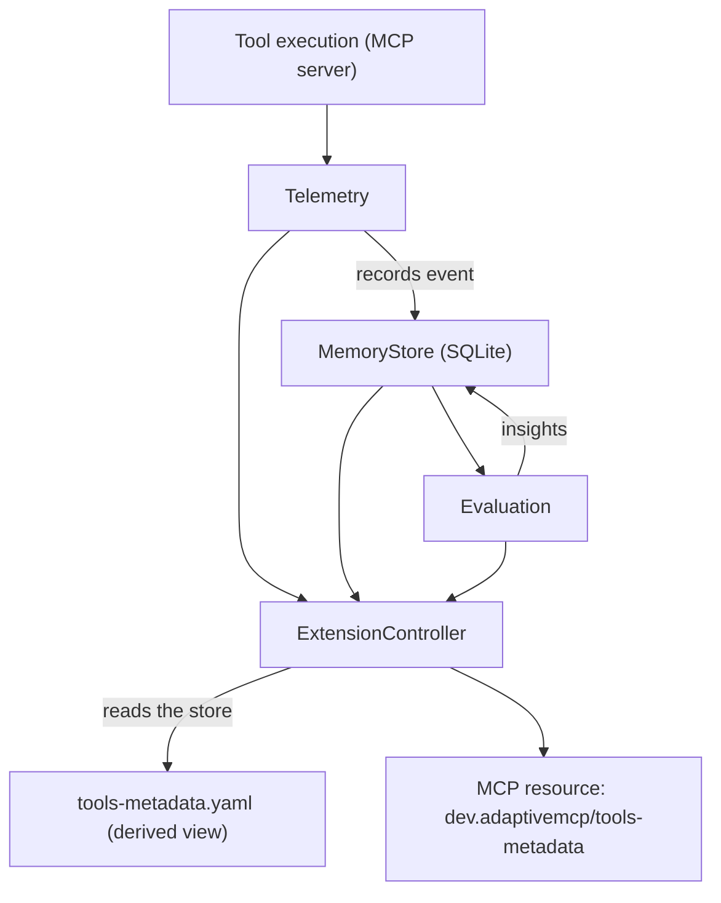

# Adaptive MCP

> **Status:** experimental. The packages are published, but the API may shift
> before 1.0.

Adaptive MCP is a runtime ecosystem that learns how MCP tools are actually used
and helps runtimes adapt to that behavior over time. It observes tool
usage, attaches learned metadata to existing MCP primitives, and lets clients
govern themselves from real signal.

> I introduced this project in the talk session
> *"Self-Improving MCP Agents"* at the [MCP Dev Summit in Seoul (2026)](https://events.linuxfoundation.org/mcp-dev-summit-seoul/).
> [Check session details & schedule](https://mcpseoul2026.sched.com/event/2PYdz/self-improving-mcp-agents-kemal-elmizan-goto-company).

## Quick start

Requires **Node 22+** (Node 26 recommended) and **pnpm 11+**

```bash
git clone https://github.com/kemalelmizan/adaptive-mcp
cd adaptive-mcp
pnpm install
pnpm -r run build
```

### Adaptation loop

The whole loop (observe, evaluate, derive view) runs locally with no server
or transport. From the repo root:

```bash
cd examples
pnpm quickstart
```

That runs [`examples/src/quickstart.ts`](./examples/src/quickstart.ts), which
feeds a few `deploy_service` calls through the learning loop and prints the
derived `tools-metadata.yaml` view:

```ts
import { MemoryStore } from "@adaptivemcp/memory";
import { TelemetryRecorder, MemoryBackedTelemetryStore } from "@adaptivemcp/telemetry";
import { Evaluator } from "@adaptivemcp/evaluation";
import { ExtensionController } from "@adaptivemcp/extension";

const memory = new MemoryStore();                                   // SQLite store
const telemetry = new TelemetryRecorder({ store: new MemoryBackedTelemetryStore(memory) });
const evaluator = new Evaluator({ memory });
const extension = new ExtensionController({ memory, yamlPath: "tools-metadata.yaml" });

// Observe a realistic stream of calls. The point of the telemetry layer is
// that it learns from *varied* signal — different tools, latency jitter, and
// the occasional failure. A loop that replays the same event 20× teaches the
// evaluator nothing (flat 0% failure rate, flat latency). Here we mix a healthy
// tool, a heavier one, and a deploy that hits a flaky window so the evaluator
// actually has something to learn.
for (let i = 0; i < 40; i++) {
  telemetry.complete({ toolName: "search_customer", serverName: "crm" }, { durationMs: 120 + Math.round(Math.random() * 40) });
}
for (let i = 0; i < 15; i++) {
  telemetry.complete({ toolName: "generate_report", serverName: "analytics" }, { durationMs: 1800 + Math.round(Math.random() * 300), cost: { amount: 0.012, currency: "USD" } });
}
for (let i = 0; i < 25; i++) {
  telemetry.complete({ toolName: "deploy_service", serverName: "demo" }, { durationMs: 900 + Math.round(Math.random() * 150) });
}
// A flaky deploy window: ~40% of these blow up, so the evaluator flags
// deploy_service as flaky and the approval gate will ask for confirmation.
for (let i = 0; i < 15; i++) {
  if (Math.random() < 0.4) {
    telemetry.fail({ toolName: "deploy_service", serverName: "demo" }, { message: "upstream timeout", code: "ETIMEDOUT" }, { durationMs: 1100 });
  } else {
    telemetry.complete({ toolName: "deploy_service", serverName: "demo" }, { durationMs: 1100 });
  }
}
evaluator.evaluateAll();   // store stats → insights → store
extension.sync();          // store → tools-metadata.yaml (and the MCP resource text)
console.log(extension.resourceText());
```

### Run the MCP server + client example

```bash
cd examples
pnpm client     # real stdio client that spawns the server and reads the resource
pnpm server     # or start the server alone (blocks on stdio)
```

### Run the scenarios

```bash
cd examples
pnpm scenario            # improvement over time (healthy → flaky → fixed)
pnpm scenario:store       # the store holds the metadata; YAML is derived
pnpm scenario:insights   # telemetry → evaluation → insights
pnpm scenario:annotation # human annotation vs. learned insight
pnpm scenario:adaptive   # full stack: routing + orchestration + approval + thin-client
```

## Architecture

The adaptation loop runs entirely on the client/runtime side:



Data always flows in one direction: **event → MemoryStore → derived
YAML view**. The YAML is never edited directly; it is recomputed from the store
whenever metadata changes.

## Design constraints

- **MCP sets the contract; Adaptive MCP learns the behavior.** MCP answers *"what
  can the model do?"*; Adaptive MCP answers *"what have we learned about how those
  capabilities are actually used?"* and turns that into metadata, not new
  primitives.
- **Enrich, don't replace.** No first-class `adaptiveTool`, `adaptiveSkill`,
  `adaptiveIntent`, or `adaptiveWorkflow` concepts. Adaptive MCP operates on MCP
  primitives (tools, resources) as intentional boundaries.
- **Avoid coupling to implementation details.** Packages must not depend on
  shell, filesystem paths, processes, sockets, or HTTP as first-class concepts.
  Those remain implementation details of the host.
- **Middleware is operational machinery.** Telemetry, evaluation, memory,
  routing, and approval exist to observe, evaluate, remember, route, and
  recommend. Business logic belongs in middleware packages; the client stays
  thin.
- **Stateless servers, accumulating clients.** MCP servers are lightweight and
  replaceable. Clients accumulate knowledge in a local source of truth.

## Relationship to MCP

> **Unofficial project.** Adaptive MCP is an independent, personal experiment.
> It is **not** affiliated with, endorsed by, or maintained by the Model Context
> Protocol project, its stewards, or any vendor. The `dev.adaptivemcp/` extension
> namespace is a reversed-domain identifier of the project domain (`adaptivemcp.dev`) 
> and is used in the spirit of, but not as part of, any official MCP extension.

The [Model Context Protocol (MCP)](https://modelcontextprotocol.io) is an open
standard that lets applications provide context and capabilities (tools,
resources, prompts) to language models in a uniform way. MCP answers *"what can
the model do?"* and standardizes the **capabilities** a server exposes.

Adaptive MCP builds on MCP rather than beside or beneath it. It does
not fork, extend, or replace the protocol; it observes how MCP tools are actually
used and attaches learned metadata (annotations, insights, recommendations) to
the **existing** MCP primitives. Concretely:

- MCP servers stay standard and stateless; Adaptive MCP adds a client-side
  learning loop and a single derived resource (`dev.adaptivemcp/tools-metadata`)
  that a server *may* publish to **govern** tool adaptation.
- The pattern is a server-governed resource that clients read and report
  against, degrading gracefully on any host that ignores it. Our draft is at
  [`docs/sep-2133-tools-metadata.md`](./docs/sep-2133-tools-metadata.md).
- Because the `dev.adaptivemcp/` prefix is our own reversed domain, this is an
  **unofficial** extension. It requires no changes to MCP itself and works with
  any compliant MCP server/client.

## Data model

All metadata is persisted in a SQLite store (`node:sqlite`). The schema is a
single `tools` table keyed by the composite `(tool_name, server_name)` pair —
not `tool_name` alone, since two different MCP servers can expose a tool with
the same name, and a `tool_name`-only key would let one server's record
silently overwrite the other's:

| Column | Type | Contents |
| --- | --- | --- |
| `tool_name` | TEXT (PK) | Tool identifier |
| `server_name` | TEXT (PK) | Originating MCP server (`''` if unknown) |
| `annotation` | JSON | Static, human-written `Annotation` |
| `insights` | JSON | Learned `Insight[]` |
| `recommendations` | JSON | Suggested `Recommendation[]` |
| `stats` | JSON | Accumulated `ToolStats` |
| `updated_at` | TEXT | ISO-8601 timestamp |

### Core types (`@adaptivemcp/spec`)

- **`Annotation`**: static, human-authored metadata (`risk`, `owner`, `tags`,
  `description`). Never changes on its own.
- **`Insight`**: learned from observed behavior (`key`, `value`, `confidence`,
  `source` of `evaluation` or `telemetry`, `sampleSize`). Upserted by key.
- **`Recommendation`**: suggested adaptation (`type` of
  `model`, `approval`, `workflow`, or `routing`, plus `payload`, `rationale`,
  `confidence`). Written by the routing/orchestration/approval packages.
- **`ToolStats`**: `invocations`, `failures`, `failureRate`, `avgDurationMs`,
  `totalCost`, `lastObservedAt`. Folded from each execution event.
- **`ToolRecord`**: the aggregate row (`toolName`, `serverName`, `annotation`,
  `insights`, `recommendations`, `stats`, `updatedAt`).

### Derived YAML view (`tools-metadata.yaml`)

The `ExtensionController` projects each `ToolRecord` into a `ToolMetadataView`
and serializes the document with `js-yaml`. The view is the machine- and
human-readable projection consumed by out-of-band MCP clients.

## Packages

| Package | Responsibility |
| --- | --- |
| `@adaptivemcp/spec` | Extension identifiers (`dev.adaptivemcp/` reversed-domain namespace), event schemas, shared types |
| `@adaptivemcp/memory` | SQLite store (`MemoryStore`) over `node:sqlite` |
| `@adaptivemcp/telemetry` | `TelemetryRecorder` + memory-backed store + stat queries |
| `@adaptivemcp/evaluation` | `Evaluator` emits `observed_failure_rate` / `avg_duration_ms` insights |
| `@adaptivemcp/extension` | `ExtensionController` derives + writes the YAML view and exposes the MCP resource |
| `@adaptivemcp/routing` | `Router`: model selection + budget guardrails |
| `@adaptivemcp/orchestration` | `Orchestrator`: retry-policy (`workflow`) recommendations |
| `@adaptivemcp/approval` | `ApprovalGate`: enforcement (allow / deny / require_confirmation) |
| `@adaptivemcp/thin-client` | `ThinClient`: client-side execution loop with gate + retry |
| `@adaptivemcp/graph-analysis` | `GraphAnalyzer`: causal cascade, bottleneck/anti-pattern detection, and forecasting over execution DAGs |
| `@adaptivemcp/middleware` | `MiddlewareChain`: pluggable hooks (`beforeCall`/`afterCall`/`onError`/`contributeView`) for transform/gate/inject-auth/observe concerns |
| `@adaptivemcp/mcp-binary` | Wraps an existing CLI binary as an MCP server over stdio — the only sanctioned shell-out layer |

### Adaptation behaviors

- **Routing** (`Router.routeTool`): picks the cheapest model meeting the
  observed latency/failure profile; emits a `routing` recommendation when a
  tool/server approaches or exceeds its cost budget (≥ 80% of limit).
- **Orchestration** (`Orchestrator.planTool`): when `failureRate ≥
  flakyThreshold` (default 0.1), writes a `workflow` recommendation with a retry
  policy scaled to the failure rate (capped at `maxAttempts = 6`).
- **Approval** (`ApprovalGate.gate`): returns `deny` for denied tools,
  `require_confirmation` for high-risk annotations or flaky tools (failure rate
  ≥ `flakyFailureRate`, default 0.2, after `minInvocations`), else `allow`.
  Writes an `approval` recommendation with `payload: { decision }`.
- **Thin client** (`ThinClient.run`): consults the gate, then executes with the
  store-derived retry policy (or default). Records the outcome back to the store.

## The `tools-metadata` extension resource

MCP formalizes the **server** contract and lets the server **govern** how clients
interact with its primitives, the same direction as the **Prompts** primitive
(server authors, client discovers and applies). Adaptive MCP adopts that pattern:
the server **governs** tool adaptation by publishing policy, and the client is
the **executor** that learns dynamically and reports observations back.

Adaptive MCP proposes a **narrow, server-governed** extension, a single resource
the server publishes so clients can read (and report against) learned tool
metadata. The proposal (draft) lives at
[`docs/sep-2133-tools-metadata.md`](./docs/sep-2133-tools-metadata.md).

| Field | Value |
| --- | --- |
| URI | `dev.adaptivemcp/tools-metadata` |
| MIME type | `application/yaml` |
| Scope | server governance (annotations, budgets, required approvals) + client-reported observations |

The `dev.adaptivemcp/` prefix is the reversed domain of `adaptivemcp.dev` (owned
by the author), using the reversed-domain namespace convention. The client learning
machinery (`@adaptivemcp/telemetry`, `evaluation`, `routing`, `orchestration`,
`approval`, `thin-client`) is the **executor** of this policy, not part of the
extension's server contract.

The derived YAML view is exposed as the MCP resource
`dev.adaptivemcp/tools-metadata` (mime type `application/yaml`).

### Advertising the extension in `initialize`

The `@modelcontextprotocol/sdk` (v1.29) includes `extensions` in its
`ServerCapabilities` schema, so a server can advertise the extension in
`initialize` via `capabilities.extensions`. Adaptive MCP's example server does
**not** rely on that negotiation. It exposes the metadata as a plain
resource via `server.registerResource(...)`, the standard MCP approach that
degrades gracefully on any host that ignores unknown resources:

- the resource is registered directly via `server.registerResource(...)`;
- the `EXTENSION_NAMESPACE` / `TOOLS_METADATA_EXTENSION` constants in
  `@adaptivemcp/spec` provide the canonical identifier for any host that wants to
  advertise it through `capabilities.extensions`.

When a server wants to advertise it explicitly, it can pass the capability:

```ts
// conceptual: advertise the extension in initialize
const server = new McpServer({ name: "adaptive-example", version: "0.1.0" });
server.registerResource("tools-metadata", "dev.adaptivemcp/tools-metadata", {
  title: "Adaptive MCP Tools Metadata",
  mimeType: "application/yaml",
}, async (uri) => ({ contents: [{ uri: uri.href, mimeType: "application/yaml", text: runtime.extension.resourceText() }] }));
// and advertise in initialize:
// capabilities: { extensions: { "dev.adaptivemcp/tools-metadata": {} } }
```

## Examples

The [`examples/`](./examples) directory is a **runnable tour** of every Adaptive
MCP package. It stands up a real MCP server + client, registers tools, and
attaches the Adaptive MCP extension so a `tools-metadata.yaml` view is derived
automatically from a SQLite store.

- **Full walkthrough.** [`examples/README.md`](./examples/README.md) walks
  through three worked examples:
  1. [A minimal MCP server with the Adaptive extension](./examples/README.md#walkthrough-1-a-minimal-mcp-server-with-the-adaptive-extension)
     registers `deploy_service` / `search_customer` tools plus the
     `dev.adaptivemcp/tools-metadata` resource.
  2. [An MCP client that reads the derived view](./examples/README.md#walkthrough-2-an-mcp-client-that-reads-the-derived-view)
     connects over stdio, calls tools, and reads the YAML resource.
  3. [The adaptation loop, locally](./examples/README.md#walkthrough-3-the-adaptation-loop-locally)
     `AdaptiveRuntime` wires the packages together without spawning a server.
- **Scenarios.** Small, focused demos of one or two packages each
  ([source](./examples/src/scenarios)):
  - `scenario.js`: improvement over time (healthy, then flaky, then fixed); the YAML
    view evolves automatically.
  - `scenarios/store.js`: the SQLite MemoryStore is the store; the YAML is a pure
    projection.
  - `scenarios/insights.js`: telemetry folds events into the store; evaluation
    emits `observed_failure_rate` / `avg_duration_ms` insights.
  - `scenarios/annotation.js`: human `Annotation` (static) vs. learned
    `Insight` (dynamic) side by side.
  - `scenarios/adaptive.js`: full stack (routing, orchestration, approval,
    thin-client).
- **Sample YAML views.** Committed, illustrative examples in
  [`examples/yaml/`](./examples/yaml).

## npm packages

Adaptive MCP publishes its core libraries under the **[`@adaptivemcp` npm
organization](https://www.npmjs.com/org/adaptivemcp)**. The packages are
dependency-light and follow the same boundaries as the architecture above.

### Published (`@adaptivemcp/*)`)

All packages below are published to npm (see `PUBLISHABLE_PACKAGES` in
[`scripts/lib/workspace.ts`](./scripts/lib/workspace.ts)), released with the
[`scripts/release.ts`](./scripts/release.ts) flow (see
[`docs/RELEASE.md`](./docs/RELEASE.md) for the full release runbook). The table
is generated from each `package.json` by `pnpm docs`; the version column is a
live npm badge.

<!-- packages:published:start -->
| Package | Version | Description |
| --- | --- | --- |
| `@adaptivemcp/spec` | [](https://www.npmjs.com/package/@adaptivemcp/spec) | Extension identifiers, event schemas, and shared types for Adaptive MCP. |
| `@adaptivemcp/memory` | [](https://www.npmjs.com/package/@adaptivemcp/memory) | Persistent operational knowledge for Adaptive MCP, backed by SQLite (node:sqlite). |
| `@adaptivemcp/telemetry` | [](https://www.npmjs.com/package/@adaptivemcp/telemetry) | Tool execution events and observability for Adaptive MCP. |
| `@adaptivemcp/evaluation` | [](https://www.npmjs.com/package/@adaptivemcp/evaluation) | Outcome scoring and feedback loops for Adaptive MCP. |
| `@adaptivemcp/extension` | [](https://www.npmjs.com/package/@adaptivemcp/extension) | Adaptive MCP extension: derives the YAML tools-metadata view from the SQLite store and serves it to MCP clients. |
| `@adaptivemcp/runtime` | [](https://www.npmjs.com/package/@adaptivemcp/runtime) | Batteries-included Adaptive MCP runtime: wires telemetry, evaluation, routing, orchestration, approval, and the extension into one transport-agnostic loop. |
| `@adaptivemcp/routing` | [](https://www.npmjs.com/package/@adaptivemcp/routing) | Model selection and cost optimization for Adaptive MCP. |
| `@adaptivemcp/orchestration` | [](https://www.npmjs.com/package/@adaptivemcp/orchestration) | Composition and execution strategies for Adaptive MCP. |
| `@adaptivemcp/approval` | [](https://www.npmjs.com/package/@adaptivemcp/approval) | Intent, plan, and tool approval boundaries for Adaptive MCP. |
| `@adaptivemcp/thin-client` | [](https://www.npmjs.com/package/@adaptivemcp/thin-client) | Minimal client-side execution loop for Adaptive MCP. |
| `@adaptivemcp/middleware` | [](https://www.npmjs.com/package/@adaptivemcp/middleware) | Pluggable middleware chain for Adaptive MCP (Transform I/O, gate, inject-auth, observe). |
| `@adaptivemcp/mcp-binary` | [](https://www.npmjs.com/package/@adaptivemcp/mcp-binary) | Generic CLI-binary -> MCP-server stdio wrapper (the only sanctioned shell-out layer). |
<!-- packages:published:end -->

### Not yet published

- **`@adaptivemcp/graph-analysis`** — fully implemented and tested (`GraphAnalyzer`:
  causal cascade, anti-pattern detection, workflow forecasting), and already a
  dependency of `routing`/`evaluation`/`opencode-plugin`, but not yet added to
  `PUBLISHABLE_PACKAGES`.
- **`@adaptivemcp/opencode-plugin`** — an experimental adapter mapping
  [OpenCode](https://opencode.ai)'s V1 hook system
  (`tool.execute.before`/`tool.execute.after`/`event`/`dispose`) onto Adaptive MCP
  telemetry and middleware. It is unit-tested against the documented hook shape
  but has not been run against a live OpenCode host — treat it as a reference
  integration, not a supported one.

## How to build, test, and run

Requires **Node 22+** (Node 26 recommended; the `node:sqlite` module is available without the
`--experimental-sqlite` flag) and **pnpm 11+**.

```bash
pnpm install
pnpm -r run build      # compile all packages + examples
pnpm test              # run the Vitest suite (unit + integration)
pnpm lint              # ESLint
```

## Testing

The suite (`vitest`) covers every package plus an end-to-end integration test:

- **Unit**: `memory` (store folding), `evaluation` (insight thresholds),
  `extension` (view projection + YAML stability), `routing` (model + budget),
  `orchestration` (retry scaling), `approval` (gate decisions), `thin-client`
  (gate + retry execution).
- **Integration**: `examples/src/runtime.test.ts` drives `AdaptiveRuntime`
  through `observeCompleted` and asserts the derived store state, the
  recommendation types, the approval gate decision, and YAML stability/disk
  write.

`node:sqlite` is loaded via a Vitest alias shim (`vitest.sqlite-shim.mjs`)
because Vite 5.x does not recognize the builtin as external; at runtime Node 26
resolves it natively.

## Repository layout

```text
adaptive-mcp/
├── packages/      # @adaptivemcp/* library packages
├── examples/      # runnable server, client, and scenarios
├── apps/          # docs / playground (scaffolds)
├── docs/          # ROADMAP.md implementation plan
├── scripts/
├── vitest.config.ts
├── vitest.sqlite-shim.mjs
├── AGENTS.md
└── README.md
```

## Status

The core adaptation loop (telemetry → evaluation → memory → extension) plus
the pluggable `middleware` chain are implemented and wired into
`AdaptiveRuntime`. `graph-analysis` (execution-graph intelligence) and
`thin-client` (client-side execution loop + graph tracking) are implemented
and tested but consumed separately, not through `AdaptiveRuntime` itself. The
`examples` scenarios validate the full adaptation loop end to end. See
`docs/ROADMAP.md` for the phased status and `examples/README.md` for the
scenario walkthrough.

This project was introduced publicly in the talk *"Self-Improving MCP Agents"*
at the [MCP Dev Summit Seoul 2026](https://mcpseoul2026.sched.com/event/2PYdz/self-improving-mcp-agents-kemal-elmizan-goto-company).

### What's next

See `docs/ROADMAP.md` Phase 6 for the full, risk/effort-ordered list of planned
work (new insight types, multi-server aggregation, conformance scenarios, a
real-host adapter, and more).

## License

Released under the [MIT License](./LICENSE). Copyright (c) 2026 Kemal Elmizan.
