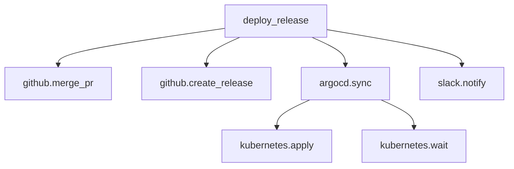

# Adaptive MCP: Distributed Execution Graph Roadmap

## Vision

Transform telemetry from **request logging** into **execution intelligence** by treating every tool invocation as a node in a directed acyclic graph (DAG). This enables:

- **Distributed traces** — end-to-end latency, critical path, tail latency
- **Performance bottlenecks** — slowest path, fan-out/fan-in analysis
- **Workflow visualizations** — auto-generated architecture diagrams
- **Dependency maps** — which tools call which, blast radius analysis
- **Success/failure rates per workflow** — not just per tool
- **Cost per workflow** — aggregate cost attribution
- **AI reasoning patterns** — how models chain tools, common failure cascades

---

## Current State Analysis

### What Exists (Phase 0-3 Complete)
| Package | Responsibility | Gap for Graph Support |
|---------|---------------|----------------------|
| `@adaptivemcp/spec` | `ToolExecutionEvent`, `ToolRecord`, `Insight`, `Recommendation` | No parent/children, no session/workflow correlation |
| `@adaptivemcp/memory` | SQLite `tools` table (SSOT) | Single-table, tool-centric; no graph edges |
| `@adaptivemcp/telemetry` | `TelemetryRecorder` + `MemoryBackedTelemetryStore` | Records individual events, no graph construction |
| `@adaptivemcp/evaluation` | `Evaluator` → insights (`observed_failure_rate`, `avg_duration_ms`) | Per-tool only, no workflow-level insights |
| `@adaptivemcp/extension` | `ExtensionController` → `tools-metadata.yaml` + MCP resource | Tool-centric view only |
| `@adaptivemcp/thin-client` | Client execution loop + middleware hooks | No automatic parent/child tracking |

### Key Missing Pieces
1. **ExecutionNode schema** — parent/children, session/workflow IDs
2. **Graph persistence** — edges table, DAG queries
3. **Graph construction** — automatic parent linking via context propagation
4. **Graph analysis** — bottleneck detection, critical path, cost aggregation
5. **Graph projection** — MCP resource + YAML view for execution graphs

---

## Phase 4: Execution Graph Foundation (Priority: HIGH)

### 4.1 Extend Spec Types (`@adaptivemcp/spec`)

**New types in `types.ts`:**
```typescript
export interface ExecutionNode {
  id: string;                    // UUID v4
  toolName: string;
  serverName?: string;
  sessionId: string;             // Groups nodes into a workflow
  workflowId?: string;           // Human-readable workflow name (e.g., "deploy_release")
  parentId?: string;             // Direct caller
  childrenIds: string[];         // Direct callees
  timestamp: string;             // ISO 8601 start time
  durationMs?: number;
  status: ToolStatus;
  input?: unknown;
  output?: unknown;
  error?: ToolError;
  model?: string;
  cost?: CostInfo;
  metadata?: Record<string, unknown>;
}

export interface ExecutionGraph {
  workflowId: string;
  sessionId: string;
  rootNodeId: string;
  nodes: Map<string, ExecutionNode>;
  createdAt: string;
  completedAt?: string;
  status: "running" | "completed" | "failed" | "partial";
}
```

**Extend `ToolExecutionEvent`:**
```typescript
export interface ToolExecutionEvent {
  // ...existing fields...
  sessionId: string;           // REQUIRED (was optional)
  workflowId?: string;         // NEW: human-readable workflow name
  parentId?: string;           // NEW: direct caller node ID
  childrenIds?: string[];      // NEW: direct callee node IDs
}
```

### 4.2 Extend MemoryStore Schema (`@adaptivemcp/memory`)

**New SQLite tables:**
```sql
-- Execution nodes (one per tool invocation)
CREATE TABLE IF NOT EXISTS execution_nodes (
  id TEXT PRIMARY KEY,
  tool_name TEXT NOT NULL,
  server_name TEXT,
  session_id TEXT NOT NULL,
  workflow_id TEXT,
  parent_id TEXT,
  children_ids TEXT NOT NULL DEFAULT '[]',  -- JSON array
  timestamp TEXT NOT NULL,
  duration_ms INTEGER,
  status TEXT NOT NULL,
  input TEXT,
  output TEXT,
  error TEXT,
  model TEXT,
  cost TEXT,
  metadata TEXT,
  FOREIGN KEY (parent_id) REFERENCES execution_nodes(id)
);

-- Indexes for common queries
CREATE INDEX IF NOT EXISTS idx_nodes_session ON execution_nodes(session_id);
CREATE INDEX IF NOT EXISTS idx_nodes_workflow ON execution_nodes(workflow_id);
CREATE INDEX IF NOT EXISTS idx_nodes_tool ON execution_nodes(tool_name);
CREATE INDEX IF NOT EXISTS idx_nodes_parent ON execution_nodes(parent_id);
```

**New methods on `MemoryStore`:**
```typescript
recordExecutionNode(node: ExecutionNode): ExecutionNode;
getExecutionNode(id: string): ExecutionNode | undefined;
getNodesBySession(sessionId: string): ExecutionNode[];
getNodesByWorkflow(workflowId: string): ExecutionNode[];
getChildren(parentId: string): ExecutionNode[];
getParent(childId: string): ExecutionNode | undefined;
getRootNodes(sessionId: string): ExecutionNode[];  // nodes with no parent
getLeafNodes(sessionId: string): ExecutionNode[];  // nodes with no children
```

### 4.3 Extend TelemetryRecorder (`@adaptivemcp/telemetry`)

**New context propagation:**
```typescript
interface GraphContext {
  sessionId: string;
  workflowId?: string;
  parentId?: string;
}

class TelemetryRecorder {
  // Start a new workflow root
  startWorkflow(ctx: ToolEventContext & { workflowId?: string }): ExecutionNode;
  
  // Start a child node (automatically links to parent)
  startChild(ctx: ToolEventContext, parentId: string): ExecutionNode;
  
  // Complete a node
  completeNode(nodeId: string, result: { durationMs: number; output?: unknown }): ExecutionNode;
  
  // Fail a node
  failNode(nodeId: string, error: ToolError): ExecutionNode;
}
```

**Automatic context propagation via thin-client middleware** (Phase 4.6).

---

## Phase 5: Graph Intelligence (Priority: HIGH)

### 5.1 GraphAnalyzer Package (`@adaptivemcp/graph-analysis`)

**New package with:**
```typescript
export class GraphAnalyzer {
  constructor(private memory: MemoryStore) {}
  
  // Core analyses
  getCriticalPath(sessionId: string): ExecutionNode[];           // Longest duration path
  getBottlenecks(sessionId: string, topN = 5): Bottleneck[];     // Slowest nodes by impact
  getFanOutAnalysis(sessionId: string): FanOutReport;            // Parallelism analysis
  getFailureCascade(sessionId: string): FailureCascade[];        // Failure propagation
  getCostBreakdown(sessionId: string): CostBreakdown;            // Cost per tool/workflow
  getWorkflowStats(workflowId: string): WorkflowStats;           // Aggregated across sessions
  
  // Pattern detection
  detectCommonPatterns(workflowId: string, minOccurrences = 3): WorkflowPattern[];
  detectAnomalies(sessionId: string): Anomaly[];
}
```

**Derived insights written back to SSOT as `Insight` entries:**
- `critical_path_duration_ms` — workflow-level latency insight
- `bottleneck_tool` — tool causing most downstream delay
- `fan_out_factor` — parallelism degree
- `failure_blast_radius` — how many nodes a failure affects
- `cost_per_workflow` — aggregated cost insight

### 5.2 Extend Evaluator (`@adaptivemcp/evaluation`)

Add workflow-level evaluation:
```typescript
evaluateWorkflow(sessionId: string): Insight[];
evaluateAllWorkflows(): void;
```

---

## Phase 6: Graph Projection & Exposure (Priority: MEDIUM)

### 6.1 Extend ExtensionController (`@adaptivemcp/extension`)

**New MCP resources:**
- `dev.adaptivemcp/execution-graph/{sessionId}` — full DAG for a session
- `dev.adaptivemcp/workflow-graph/{workflowId}` — aggregated workflow pattern
- `dev.adaptivemcp/graph-insights/{sessionId}` — derived insights

**YAML view extension (`tools-metadata.yaml`):**
```yaml
tools:
  deploy_service:
    # ...existing fields...
    graphInsights:
      avgCriticalPathMs: 12500
      commonBottlenecks: ["kubernetes.apply", "argocd.sync"]
      typicalFanOut: 3
      failureBlastRadius: 4
workflows:
  deploy_release:
    avgDurationMs: 45000
    successRate: 0.92
    avgCost: 0.045
    commonPatterns:
      - pattern: "sequential_deploy"
        frequency: 0.7
```

### 6.2 Graph Visualization Resource

Expose as MCP resource with Mermaid/GraphViz format:


---

## Phase 7: Thin-Client Integration (Priority: HIGH)

### 7.1 Automatic Context Propagation (`@adaptivemcp/thin-client`)

**Middleware that automatically:**
1. Generates `sessionId` at workflow start (or uses incoming)
2. Tracks `parentId` from call stack
3. Emits `startChild` / `completeNode` / `failNode` automatically
4. Propagates context via MCP `requestId` / custom headers

```typescript
class GraphTrackingMiddleware {
  private sessionId: string;
  private nodeStack: string[] = [];
  
  async onToolCall(toolName: string, args: unknown, next: NextFn) {
    const parentId = this.nodeStack[this.nodeStack.length - 1];
    const node = this.telemetry.startChild({ toolName, ... }, parentId);
    this.nodeStack.push(node.id);
    
    try {
      const result = await next(args);
      this.telemetry.completeNode(node.id, { durationMs: ..., output: result });
      return result;
    } catch (e) {
      this.telemetry.failNode(node.id, { message: e.message });
      throw e;
    } finally {
      this.nodeStack.pop();
    }
  }
}
```

### 7.2 Workflow Boundary Detection

- **Explicit**: `workflowId` passed in context
- **Implicit**: Heuristic — root node = no parent, or MCP `initialize` boundary
- **Named**: Well-known workflows (deploy, test, build) get stable `workflowId`

---

## Phase 8: Example Scenarios (Priority: MEDIUM)

### 8.1 Scenario: `deploy_release` DAG Visualization

```typescript
// examples/src/scenarios/execution-graph.ts
const runtime = new AdaptiveRuntime({ yamlPath: "tools-metadata.graph.yaml" });

// Simulate a deployment workflow
const sessionId = "deploy-123";
runtime.telemetry.startWorkflow({ 
  toolName: "deploy_release", 
  sessionId, 
  workflowId: "deploy_release" 
});

// Parallel fan-out
const mergePr = runtime.telemetry.startChild({ toolName: "github.merge_pr", sessionId }, rootId);
const createRelease = runtime.telemetry.startChild({ toolName: "github.create_release", sessionId }, rootId);

// Sequential chain under argocd.sync
const argocdSync = runtime.telemetry.startChild({ toolName: "argocd.sync", sessionId }, rootId);
const k8sApply = runtime.telemetry.startChild({ toolName: "kubernetes.apply", sessionId }, argocdSync.id);
const k8sWait = runtime.telemetry.startChild({ toolName: "kubernetes.wait", sessionId }, k8sApply.id);

// Notification
const notify = runtime.telemetry.startChild({ toolName: "slack.notify", sessionId }, rootId);

// Complete all...
runtime.evaluator.evaluateAll();
runtime.graphAnalyzer.analyzeAll();
runtime.extension.sync();

console.log(runtime.extension.resourceText()); // Shows graph insights
```

### 8.2 Scenario: Failure Cascade Analysis

Simulate `kubernetes.apply` failing → observe `failure_blast_radius` insight → see approval recommendation for `argocd.sync`.

### 8.3 Scenario: Cost Optimization

Aggregate cost per workflow → routing recommendation for cheaper model on high-volume leaf tools.

---

## Implementation Priority Order

| Phase | Package | Effort | Impact | Dependencies |
|-------|---------|--------|--------|--------------|
| 4.1 | `@adaptivemcp/spec` | Low | Foundation | — |
| 4.2 | `@adaptivemcp/memory` | Medium | Foundation | 4.1 |
| 4.3 | `@adaptivemcp/telemetry` | Medium | Foundation | 4.1, 4.2 |
| 5.1 | `@adaptivemcp/graph-analysis` (NEW) | High | Core Value | 4.2 |
| 5.2 | `@adaptivemcp/evaluation` | Medium | Core Value | 5.1 |
| 6.1 | `@adaptivemcp/extension` | Medium | Exposure | 5.1 |
| 7.1 | `@adaptivemcp/thin-client` | High | Automation | 4.3 |
| 8.x | `examples` | Medium | Validation | All |

---

## Migration Strategy

1. **Backward compatible**: Existing `ToolExecutionEvent` without `sessionId`/`parentId` still works (treated as root nodes)
2. **Opt-in graph**: Thin-client middleware off by default; enable via `AdaptiveRuntimeOptions.enableGraph = true`
3. **Progressive enhancement**: Graph insights appear in YAML only when graph data exists
4. **No schema breaking changes**: New tables, new columns nullable, new types additive

---

## Success Metrics

- [ ] `deploy_release` scenario prints full Mermaid graph in YAML
- [ ] `graphAnalyzer.getCriticalPath()` returns correct path for multi-phase scenario
- [ ] `failure_blast_radius` insight triggers approval recommendation
- [ ] Cost per workflow aggregated correctly across 100+ simulated runs
- [ ] Thin-client middleware automatically builds graph without manual instrumentation
- [ ] MCP client can fetch `dev.adaptivemcp/execution-graph/{sessionId}` resource

---

## Related Documents

- `docs/ROADMAP.md` — Main project roadmap (Phases 0-4 complete)
- `docs/sep-2133-tools-metadata.md` — MCP extension spec (graph resource to be added)
- `packages/spec/src/types.ts` — Core type definitions (to be extended)
- `packages/memory/src/store.ts` — SQLite SSOT (schema to be extended)